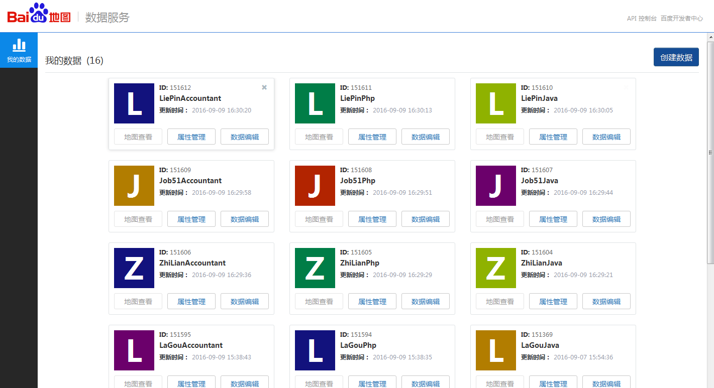

# JobMap
职位分布图

1、环境配置，分别需要在Hi.Web/Web.config与Job.Agent/App.config配置百度地图浏览器端（BaiduJsAk）与服务器端访问密钥BaiduAk

2、服务执行分三步，第一步拉取一批代理.第二步爬取职位信息.第三步根据爬取到的地址获取对应poi地址
##### 示例代码
	      //可以把下面的注释全放开一次性全跑完，不过这样使用时间长，并且一出错，还需要重头跑。建议一个个注释，一个个跑。
	      //先跑一批代理，使用拉勾网站测试代理ip是否可用
            LaGouRequest request = new LaGouRequest();
            request.TestProxy(".net", "北京");
            //Int32 count = 4;
            //for (int i = 0; i < count; i++)
            //{
            //    //爬取职位信息
            //    DownloadPosition(i);
            //}
            //处理公司信息，并根据地址获取poi坐标
            //ProcessCompany(index);
3、执行JobController下的CreateGeoTable用来创建云存储表。
#### 效果图

3、爬虫与前端借鉴博客：http://www.cnblogs.com/zhaopei/p/job_hunting.html
   代理爬取借鉴博客：http://www.cnblogs.com/Lands-ljk/p/5673017.html
